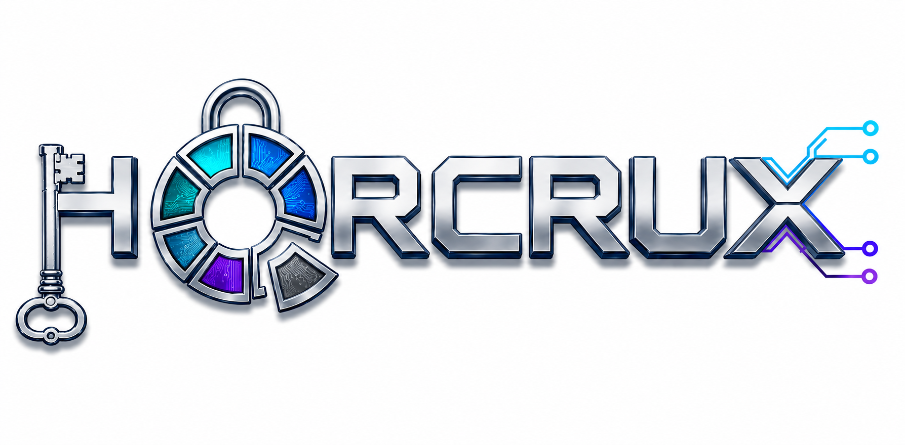

# HORCRUX

Welcome to the official repository for **HORCRUX**. 

HORCRUX is an ongoing project representing an evolving lightweight Post-Quantum Cryptography (PQC) RISC-V extension architecture. The development of this project is divided into different stages, with each stage representing a distinct step forward in the architecture's capabilities and implementation.

## 🐍 Project Naming and Branch Evolution

We chose the name **HORCRUX** to reflect the modular and multi-part nature of our architecture. Continuing with this theme, the distinct developmental stages of the project are represented by separate branches, taking inspiration from the well-known magical artifacts. 

Below are the links to the active branches representing our current versions:

* **[Cup](https://github.com/vlsi-lab/HORCRUX/tree/cup)**
* **[Diadem](https://github.com/vlsi-lab/HORCRUX/tree/diadem)**
* **[Locket]([tree/locket](https://github.com/vlsi-lab/HORCRUX/tree/locket))**

*(Future/Reserved branches include: Diary, Ring, Nagini, and Harry).*

*(Note: Click on the Locket, Cup, or Diadem links to navigate to the respective branch for that specific version of the architecture).*

---

## 📎 References

If you use or build upon the work in these branches, please cite the corresponding papers:

**For the `cup` branch:**
Alessandra Dolmeta, Valeria Piscopo, Guido Masera, Maurizio Martina, and Michael Hutter. "HORCRUX - A Lightweight PQC-RISC-V eXtension Architecture." *Cryptology ePrint Archive, Paper 2025/1934* (2025). Available at: https://eprint.iacr.org/2025/1934

**For the `diadem` branch:**
Valeria Piscopo, Alessandra Dolmeta, Maurizio Martina, Guido Masera, and Michael Hutter. "Raise the Shields: A Modular RISC-V Extension for Post Quantum Cryptography." *In 63rd ACM/IEEE Design Automation Conference (DAC ’26)*, July 26–29, 2026, Long Beach, CA, USA. ACM, New York, NY, USA, 7 pages. https://doi.org/10.1145/3770743.3804373

**For the `locket` branch:**
TO BE DEFINED

---

## 📄 License
This repository follows the licensing terms of the respective reference implementations used as the starting point. Please check individual algorithm directories for specific license details.

## 👥 Authors

- **Alessandra Dolmeta** - alessandra.dolmeta@polito.it
- **Valeria Piscopo** - valeria.piscopo@polito.it
