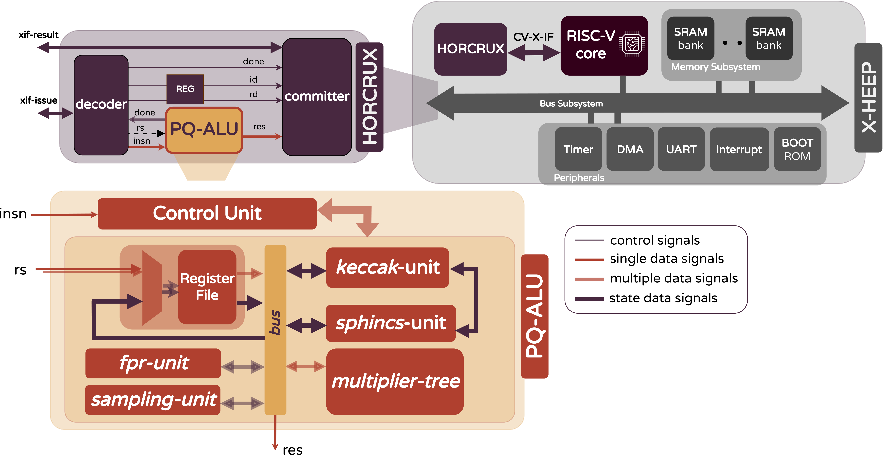

# HORCRUX — Locket

**Locket** is the third and most complete stage of **HORCRUX**, a modular hardware–software framework for accelerating Post-Quantum Cryptography (PQC) on RISC-V.

Locket extends the [Cup](https://github.com/vlsi-lab/HORCRUX/tree/cup) (eprint) and [Diadem](https://github.com/vlsi-lab/HORCRUX/tree/diadem) (DAC'26) architectures to cover **all five NIST-selected PQC families** — **ML-KEM**, **ML-DSA**, **SLH-DSA**, **HQC**, and **Falcon** — through a single, tightly-coupled coprocessor. Rather than instantiating algorithm-specific accelerators, Locket shares hardware resources (a unified multiplier tree, a Keccak engine, a sampler, and a floating-point unit for Falcon) across all supported schemes behind a common RISC-V custom Instruction-Set Extension (ISE), keeping the design crypto-agile while minimizing area and energy overhead on embedded targets.

<p align="center">
  
</p>
<p align="center"><i>HORCRUX coprocessor datapath and integration into the X-HEEP-based SoC.</i></p>

## 📁 Repository Structure

```bash
HORCRUX/
├── config/                  # X-HEEP / crheepto build & pad configuration
├── hw/
│   ├── ip/coprocessors/     # HORCRUX coprocessor RTL + ISA — see hw/ip/coprocessors/README.md
│   ├── fpga/                # FPGA-specific wrappers
│   └── vendor/               # X-HEEP SoC (vendored)
├── scripts/                 # Build, simulation & power automation — see scripts/README.md
├── sw/applications/          # Software tests & PQC algorithms — see sw/applications/README.md
│   ├── tests/                # Per-instruction HW/SW correctness tests
│   ├── tests-power/           # Power-characterization variants of the tests above
│   └── pqc/                   # Full baseline / optimized PQC algorithms
├── tb/                       # Simulation testbenches
└── util/                     # crheepto/X-HEEP generation utilities
```

## 🚀 Getting Started

Clone the repository and generate the MCU and coprocessor sources:
```bash
git clone <your_repo_url>
cd HORCRUX
make mcu-gen
make crheepto-gen
```

## 📚 Documentation

| Topic | Where |
|---|---|
| Coprocessor modules and the full HORCRUX Instruction Set | [`hw/ip/coprocessors/README.md`](hw/ip/coprocessors/README.md) |
| All software tests & PQC applications, and how to run them | [`sw/applications/README.md`](sw/applications/README.md) |
| Post-synthesis power-characterization tests | [`sw/applications/tests-power/README.md`](sw/applications/tests-power/README.md) |
| Build, simulation, FPGA and power-analysis automation scripts | [`scripts/README.md`](scripts/README.md) |

## 🧪 Quick Examples

Run a single instruction-level test (e.g. the Keccak accelerator):
```bash
make app PROJECT=tests/keccak-abs
make questasim-sim
```

Run a full PQC algorithm (e.g. ML-KEM-512, optimized):
```bash
make app PROJECT=pqc/optimized/KEM/ML-KEM/ml-kem-512
make questasim-sim
```

Run the power-characterization variant of a test (e.g. Karatsuba multiplication):
```bash
make app PROJECT=tests-power/karats
make questasim-run-postsynth VCD_MODE=2
make power-analysis
```

See [`sw/applications/README.md`](sw/applications/README.md) for the complete list of tests and applications, one example per category is shown above.

## 📟 Simulation Set Up

```bash
make questasim-sim
```

## 🔧 FPGA Set Up

```bash
make vivado-fpga-synth FPGA_BOARD=zcu104
```

## 🏗️ ASIC Synthesis

```bash
make synthesis
```
All commands for the ASIC flow (synthesis, PnR, power analysis) are kept in this repository for completeness; sensitive scripts and PDK-specific files have been removed. See [`scripts/README.md`](scripts/README.md) for the post-synthesis power-analysis flow.

## 📊 Results

Cycle-count comparison between the software-only **Baseline** and the **Optimized** (HORCRUX-accelerated) implementation, averaged over 100 KAT executions. `kCC` = thousand cycles, `SU` = speedup factor.

| Algorithm | Ver. | KeyGen kCC | KeyGen SU | Enc/Sign kCC | Enc/Sign SU | Dec/Ver kCC | Dec/Ver SU |
|---|:-:|--:|--:|--:|--:|--:|--:|
| **ML-KEM-512**  | B | 900 | — | 965 | — | 1,108 | — |
| **ML-KEM-512**  | O | 163 | 5.52× | 189 | 5.11× | 290 | 3.82× |
| **ML-KEM-768**  | B | 1,475 | — | 1,602 | — | 1,789 | — |
| **ML-KEM-768**  | O | 260 | 5.67× | 289 | 5.54× | 426 | 4.20× |
| **ML-KEM-1024** | B | 2,357 | — | 2,500 | — | 2,739 | — |
| **ML-KEM-1024** | O | 389 | 6.06× | 421 | 5.94× | 601 | 4.56× |
| **HQC-1** | B | 46,108 | — | 92,006 | — | 140,074 | — |
| **HQC-1** | O | 2,316 | 19.9× | 4,357 | 21.1× | 7,123 | 19.7× |
| **HQC-3** | B | 139,965 | — | 279,352 | — | 421,874 | — |
| **HQC-3** | O | 6,801 | 20.6× | 12,967 | 21.5× | 20,039 | 21.1× |
| **HQC-5** | B | 344,053 | — | 687,260 | — | 1,024,298 | — |
| **HQC-5** | O | 13,323 | 25.8× | 25,334 | 27.1× | 38,695 | 24.5× |
| **ML-DSA-44** | B | 3,444 | — | 6,820 | — | 3,618 | — |
| **ML-DSA-44** | O | 458 | 7.52× | 1,537 | 4.44× | 592 | 6.11× |
| **ML-DSA-65** | B | 6,041 | — | 23,455 | — | 6,084 | — |
| **ML-DSA-65** | O | 790 | 7.65× | 6,177 | 3.80× | 913 | 6.66× |
| **ML-DSA-87** | B | 10,235 | — | 26,738 | — | 10,394 | — |
| **ML-DSA-87** | O | 1,116 | 9.17× | 6,360 | 4.20× | 1,386 | 7.50× |
| **SLH-DSA-128-fs** | B | 138,814 | — | 1,627,526 | — | 190,001 | — |
| **SLH-DSA-128-fs** | O | 1,905 | 72.9× | 45,335 | 35.9× | 2,930 | 64.8× |
| **SLH-DSA-128-fr** | B | 262,561 | — | 1,835,864 | — | 375,824 | — |
| **SLH-DSA-128-fr** | O | 2,041 | 128.7× | 48,582 | 37.8× | 3,223 | 116.6× |
| **SLH-DSA-192-fs** | B | 201,918 | — | 991,317 | — | 275,172 | — |
| **SLH-DSA-192-fs** | O | 3,553 | 56.8× | 96,253 | 10.3× | 5,445 | 50.5× |
| **SLH-DSA-192-fr** | B | 384,731 | — | 1,283,162 | — | 555,947 | — |
| **SLH-DSA-192-fr** | O | 3,729 | 103.2× | 101,150 | 12.7× | 5,956 | 93.3× |
| **SLH-DSA-256-fs** | B | 536,735 | — | 2,416,664 | — | 293,555 | — |
| **SLH-DSA-256-fs** | O | 11,258 | 47.7× | 240,821 | 10× | 6,902 | 42.5× |
| **SLH-DSA-256-fr** | B | 1,024,313 | — | 3,325,795 | — | 558,107 | — |
| **SLH-DSA-256-fr** | O | 12,064 | 84.9× | 249,327 | 13.3× | 7,254 | 76.9× |
| **Falcon-512**  | B | 162,348 | — | 67,331 | — | 585 | — |
| **Falcon-512**  | O | 117,786 | 1.38× | 48,610 | 1.39× | 258 | 2.27× |
| **Falcon-1024** | B | 576,874 | — | 147,135 | — | 1,207 | — |
| **Falcon-1024** | O | 437,859 | 1.32× | 116,874 | 1.26× | 530 | 2.28× |

*B = Baseline, O = Optimized. Both configurations compiled with RV32IMACB (`RV32IMAC_Zba_Zbb_Zbc_Zbs`).*

## 📄 License

This repository follows the licensing terms of the respective reference implementations used as the starting point. Please check individual algorithm directories for specific license details.

## 📎 Reference

**For the `locket` branch:**
Alessandra Dolmeta, Valeria Piscopo, Michael Hutter, Maurizio Martina, and Guido Masera. "HORCRUX: A Complete PQC RISC-V eXtension Architecture." *(manuscript in preparation)*.

## 👥 Authors

- **Alessandra Dolmeta** - alessandra.dolmeta@polito.it
- **Valeria Piscopo** - valeria.piscopo@polito.it
